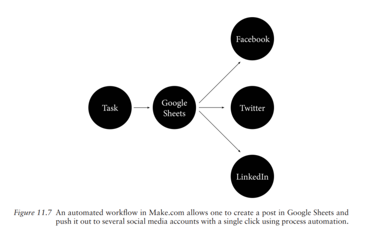

# 利用生成式 AI 帮助 UX 写作

## 背景

*UX Writing: Designing User-Centered Content* （《UX 写作：设计以用户为中心的内容》）于 2023 年出版，由 Jason Chew Kit Tham、Tharon Howard 和 Gustav Verhulsdonck 合著。他们分别任教于德克萨斯理工大学、克莱姆森大学和中央密歇根大学，一直从事技术传播和和信息系统领域的教学与研究。

该书介绍了 UX 写作 （User experience writing）的基本原则和方法，适合希望对 UX 写作有系统性了解的读者。以下内容选取了书中关于 AI 技术的章节（如下），介绍生成式 AI 技术在 UX 写作中的理论与实践应用。

## 理论：如何理解 AI 与 UX 写作？

AI 是什么？ 可以认为它是一种拓展技术（Augmentation technology），其作用不在于取代人，而是拓展人的能力边界。
>
> "AI extends, and thus augments, human capabilities
by automatically generating text, images, videos, or music (that a human user takes hours, if not days, to create) in just a few seconds". (2023: 211).

尽管 AI 技术极大提高了文本生产效率，但是其在准确性、伦理和法律方面还是存在局限性。其局限性决定了 (1) 在 UX 写作中，AI 仍然需要人的参与；（2）基于 （1），UX 写作者需要知道如何与 AI 协作，推动 UX 内容的生产。简言之，UX 写作者需要拆解相关的工作流，判断哪些可以交给 AI 做，哪些必须自己做。

基于生成式 AI 的特点和局限，该书提出了一种 UX 写作的人机协作模式：HEAT 模式。
>
> HEAT: Writers bring their Human Experience, Ethics, Authenticity, and Trust to AI-written content. (2023: 213)

这种模式的逻辑是，AI 不如 UX 写作者了解真实的用户和需求场景，所以需要 UX 写作者充当质检员的角色，一是核对 AI 生成内容，确保内容的准确性；二是从用户的角度出发，增强内容的用户体验和使用感受；三是从伦理和法律的角度出发，约束和修正 AI 可能存在的侵权和歧视行为，确保法律合规性和伦理合理性。

## 实践：生成式 AI 在 UX 写作中的应用

有关生成式 AI 如何在 UX 内容生产中发挥作用，该书给了一个很生动的比喻：剥洋葱。洋葱的每一层都是生成式 AI 一个具象的能力：（1）第一层是利用深度学习和神经网络具备的学习能力，根据输入来不断迭代演化；（2）第二层是通过自然语言处理（NLP）与用户进行对话，分析用户的意图和对象；（3）第三层是通过自然语言生成（NLG）以易于理解的格式回答用户。
>
> "Think of generative AI like the act of peeling the layers of an onion. Each layer in an AI adds something that creates the illusion that you are talking to an intelligent person." (2023: 220)

一般来说，一个标准的 UX 写作流程包括以下步骤：
- 用户研究
- 内容策略
- 信息架构
- 内容创建
- 内容和视觉设计整合
- 用户测试
- 反馈优化
- 发布维护

那么，生成式 AI 如何在 UX 写作流中发挥作用？书中提到了两方面：内容生产和工作流的自动化。其实基于对生成式 AI 本质能力的认识，其在 UX 写作应用不仅仅局限于这两个方面，AI 能发挥什么作用，需要从具体的问题出发。先定义问题，再思考如何利用 AI 解决问题。这个思路不仅适用 UX 写作，也适合在 AI 应用的其它领域。

### 利用生成式 AI 进行内容生产

生产和创作 UX 内容时，生成式 AI 的使用场景有以下几个方面：
- 利用 AI 提示词生成内容。这是生成式 AI 在内容生产中应用范围最广的一个场景。写作者可以根据具体场景让 AI bot 为其编写内容，如何编写 AI 指令取决于具体需求场景，越具体越好。
  
- 利用 AI 进行用户研究。书中提到，可以让 AI 帮助清理和分析用户数据，使用 AI 快速进行一些前置性的用户数据分析和情感分析。但 AI 在这方面只能做一些简单基础的工作。

- 利用 AI bot 进行头脑风暴。在创作内容卡住时，写作者可以使用 AI bot 提供一些好的想法，因为 AI 本身可以以迭代的方式学习，提供就某一个话题的想法。

### 利用生成式 AI 自动化工作流

除了内容的生产和创作外，生成式 AI 也可以提升 UX 写作工作流的自动化。原因在于，目前的 UX 写作会使用不同的工具和应用，内容物料的存放、维护和发布在不同的平台和应用进行，呈现断裂分散的特点。每次发布一份内容，UX 写作者需要将其从不同的工具中导出并整合，再发布到多个内容渠道，会产生很多重复的人力工作。对于这些问题，常见的内容管理系统（Content Management System, CMS）可以实现部分工作流的自动化，比如设定什么时间发布什么内容。但有些问题比如将同一份内容发布到多个渠道里，内容管理系统就有些爱莫能助了。这种情况下，该书提到了“无代码自动化”（No-Code Automation）工具。

”无代码自动化“，拆开看是“无代码”和“自动化”。无代码是手段，写作者仅需要做一些 UI 操作就能建立起一个工作流，降低了自动化实现的难度；自动化是目的，通过将 AI 集成到工作流程中来大大减少重复的人力工作。书中介绍了一些无代码自动化工具，如 [Make.com](https://www.make.com/en), [Microsoft Power Automate](https://www.microsoft.com/en-us/power-platform/products/power-automate)。这些工具可以集成 Google Drive、Gmail、 Slack、Twitter、LinkedIn、Facebook 和 Figma。

书里提到一个例子 Make.com，如下：

这个例子中，所有的内容都统一存在放 Google Sheets 里，然后通过自动化工具统一分发到 Facebook，Twitter 和 Linkedin 各个渠道中。

