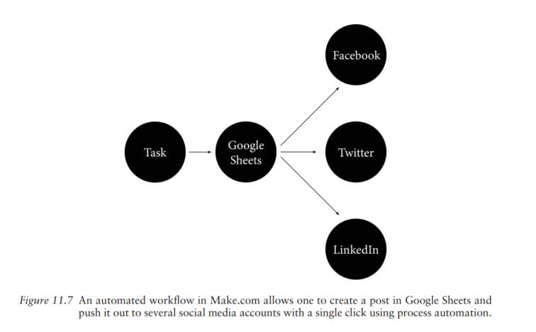

# 利用 AI 技术帮助 UX 写作

## 背景

*UX Writing: Designing User-Centered Content* 于 2023 年出版，由 Jason Chew Kit Tham、Tharon Howard 和 Gustav Verhulsdonck 合著。该书介绍了 UX 写作 （User experience writing）的基本原则和方法，适合希望掌握 UX 写作系统性知识的读者。以下内容选取了书中关于 AI 技术的章节（如下），介绍生成式 AI 技术在 UX 写作中的理论与实践应用。

## 理论：如何理解 AI 与 UX 写作？

AI 是什么？ 它可以认为是一种拓展技术（Augmentation technology），其作用不在于取代人，而是拓展人的能力边界。
>
> "AI extends, and thus augments, human capabilities
by automatically generating text, images, videos, or music (that a human user takes hours,
if not days, to create) in just a few seconds". (2023: 211).

尽管 AI 技术极大提高文本生产效率，但是其在准确性、伦理和法律方面的局限性依然存储。 AI 技术的局限性决定了 (1) 在 UX 写作中 AI 仍然需要人的参与；（2）UX 写作者需要知道如何与 AI 协作，推动 UX 内容生产。简言之，对于从事 UX 内容生产的从业者和实践者来说，其实就是拆建相关的工作流，判断哪些可以交给 AI 做，哪些必须自己做。

基于生成式 AI 的特点（局限），书中提出一种 UX 写作的人机协作模式：HEAT 模式。
>
> HEAT: Writers bring their Human Experience, Ethics, Authenticity, and Trust to AI-written content. (2023: 213)

这种模式的逻辑是，AI 不如 UX 写作者了解真实的用户和需求场景，所以需要 UX 写作者充当质检员的角色，一是核对 AI 生成内容，确保内容的准确性；二是从用户的角度出发，增强内容的用户体验和使用感受；三是从伦理和法律的角度出发，约束和修正 AI 可能存在的侵权和歧视行为，确保法律合规性和伦理合理性。

## 实践：生成式 AI 在 UX 写作中的应用

一般来说，一个标准的 UX 写作流程主要包括用户研究、内容策略、信息架构、内容创建、整合内容和视觉涉及、用户测试、反馈优化和发布维护这些步骤。书中对于 AI 在 UX 写作的实践应用主要有两方面：内容生产和自动化工作流。

### 利用生成式 AI 进行内容生产

- 利用 AI 提示词生成内容。
  
- 利用 AI 进行用户研究。书中提到，可以让 AI 帮助清理和分析用户数据，使用 AI 快速进行一些前置性的用户数据分析和情感分析。但 AI 在这方面只能做一些简单基础的工作。

- 创作内容卡住时，可以利用 AI bot 提供一些好的想法。AI 本身可以以迭代的方式学习，提供就某一个话题的想法。

### 利用生成式 AI 自动化工作流

除了内容生产，书中也介绍了生成式 AI 在 UX 写作工作流的一些自动化案例。自动化工作流的背景是，UX 写作使用的工具分散在各个平台上，每次完成相应的内容要进行发布时，需要从将信息从不同工具中导出，再发布到不同渠道里，内容物料的创作、分发和维护会有很多重复工作。因此，书中提到了"无代码自动化”（No-code automation）这个概念，将不同工具通过 AI 无代码理念集成到同一个工作流，减少人的重复工作。

书里提到一个例子 Make.com，如下：

这个例子中，所有的内容都统一存在放 Google Sheets 里，然后通过自动化工具统一分发到 Facebook，Twitter 和 Linkedin 各个渠道中。

